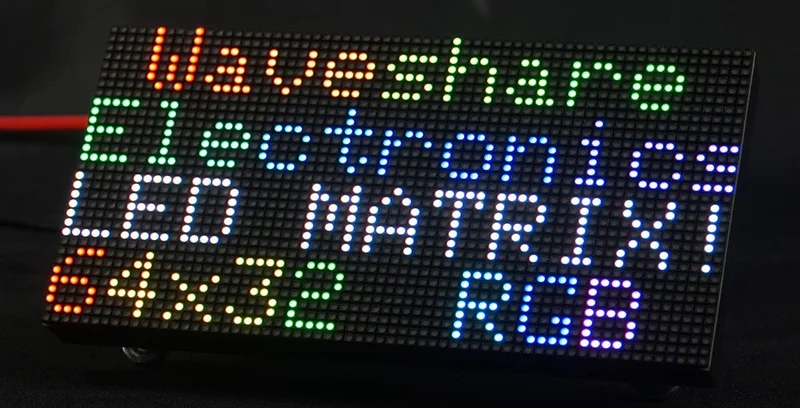
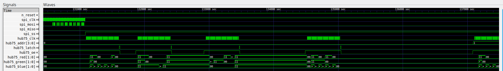

# HUB75 controller in Verilog

These notes are fairly preliminary.

This is a HUB75 64x32 LED panel controller written in Verilog. That is, it is a controller design, capable of being loaded into an FPGA, for panels such as this one:

It is used by my [matrix-display](https://github.com/aslak3/matrix-display) project as an alternative to driving the HUB75 screen using the Pi Pico W board's [PIO function](https://blues.com/blog/raspberry-pi-pico-pio/) for flicker-free operation, though naturally it could easily be incorporated into other projects.

In terms of FPGAs used, my board uses an [iCE40UP5](https://www.latticesemi.com/en/Products/FPGAandCPLD/iCE40UltraPlus) in QFN48 and the constraints.pcf file reflects this, which will shortly be documented in its own repo. The Open Source lattice tools, critically [yosys](https://github.com/YosysHQ/yosys) and [nextpnr](https://github.com/YosysHQ/nextpnr), are used to produce the bitstream.

The protocol used between the host controller/computer and the HUB75 controller is SPI. The image format is currently fixed at 64 x 32 pixels, with 32 bits per pixel in the form RGBx, where the last byte in the quad is not used. Data is latched on the rising clock. Naturally scanning should start at the top left pixel and extend line by line.

The controller uses a pseudo dual port RAM to hold the image to display: the writing side is attached to the SPI slave controller with the HUB75 signals being derived from the outputs of the reading side. This RAM is inferred by the code. At 16bpp, 64Kbit of Block RAM is required; 64 x 32 x 16 per frame, and two frames need to be held because  he RAM is configured in a double buffered arrangement.

While the SPI slave interface is being fed frames from the host, the reading side is showing the previously received frame. Switching between buffers is accomplished by the host side toggling the SPI "Slave Select" line. Thus the host should send a frame, flip the SS line, send the next frame, flip the SS line, etc.

I'm currently clocking the SPI side at 10MHz, with the master reading clock at 50MHz. The reading side is reduced down by four. Due to the PWM nature of the output, this yields a frame rate of about 190 frames a second.

Whilst the host to controller image format is fixed at 64 x 32 at 32bpp, the image format used internally is configurable via the Makefile's only config option: BITS_PER_PIXEL. I use 16bpp, as this is the largest bit depth that will fit in the iCE40UP5 block RAM on my display interface board. The SPI component is responsible for discarding the lower bits from each byte received.

A fairly complete set of tests has been produced including one which will drive the controller for a single frame. The output from this test can be fed into the unscaled-to-image Go script to produce a BMP file of the output. Another Go script, image-to-raw, can be used to turn a BMP into a data file for feeding to the controller testbench. Tests are also available for the SPI slave interface and the dual port video memory.

The above gives a very high level overview of the mechanism behind the display. Starting form the left, you can see the last few pixels being clocked in over the SPI bus. After the Slave Select line is toggled, the output clock is started and the controller clocks out the first PWM'd row of pixels. You can see that after a row of pixels is clocked out, it is latched and the Output Enable stobe line is lowered. The same row is output four times, with an increasing long OE strobe. This is the PWM action: for each bit of the four that need to be shown a doubling of the OE strobe length needs to occur. The length of these OE pulses dictates the intensity of the line of pixels, but the tradeoff is the longer each line is shown the more the screen will flicker. The code presented here is tuned, by at least my own eyes, to a 50MHz master clock and it yields a flicker free image which is nice and bright.

## Building

The following tools are used by the Makefile. The assumption is you'll be wanting a bitstream file for programming into a SPI flash:

* [Verilator](https://www.veripool.org/verilator/) - This is used only for passing the source text through the lint option
* [iverilog](https://github.com/steveicarus/iverilog) - This is used for building the test benches so is, I suppose, optional
* [yosys](https://github.com/YosysHQ/yosys) - Used for the first stage of the bistream building
* [nextpnr](https://github.com/YosysHQ/nextpnr) - Used for producing the bitstream image for the target FPGA

If you are interested in running the Go test tools, you'll obviously need Go installed.

Use `make controller.bin` to produce the bitstream image and flash it using your tool of choice.

Use something like `make controller-tests | (cd tools/unscaled-to-image/ && go run . --output-filename image.bmp)` to run the controller tests and generate a BMP of the test image file.

## Related projects

* [Matrix Display](https://github.com/aslak3/matrix-display) - A Pi Pico W based firmware utilising a HUB75 panel to show various information from a [Home Assistant](https://www.home-assistant.io/) installation. The solution supports this display controller as an option; alternatively a display can be directly attached to the Pico W board, though this has downsides.
